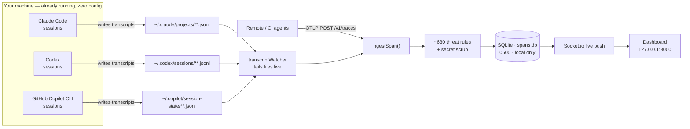
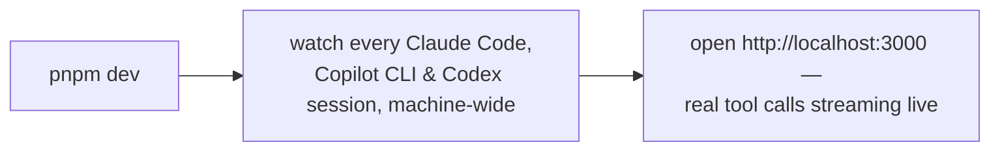
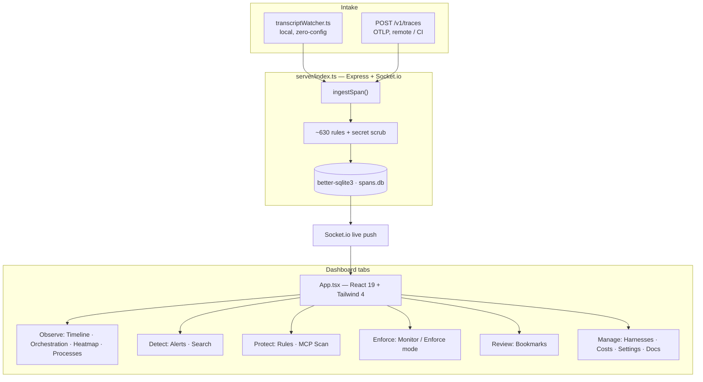
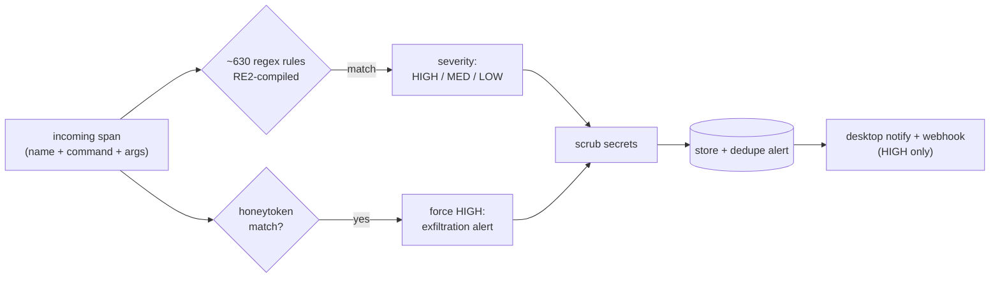

# ClaudeSec

[](https://github.com/aanjaneyasinghdhoni/ClaudeSec/actions/workflows/ci.yml)
[](https://github.com/aanjaneyasinghdhoni/ClaudeSec/actions/workflows/codeql.yml)
[](LICENSE)
[](https://nodejs.org)

**A zero-config, fully-local security observatory for AI coding agents.**

ClaudeSec watches every Claude Code, GitHub Copilot CLI, and Codex session already running on your machine — across every repo — and surfaces what your agents are actually doing: every tool call, every command, every file touched, scored live against ~630 built-in threat-detection rules. Nothing ever leaves your computer.

---

## What it is

These agents **already write full session transcripts to disk** as they work. ClaudeSec tails those transcripts in real time, so the moment you start it, it sees everything — including sessions that were already running before you installed it.



The local transcript watcher and the OpenTelemetry endpoint feed the **same** pipeline, so local-machine agents and remote or CI agents all land in one dashboard.

### Capabilities

- **Live timeline and orchestration** — real tool calls streaming in with nanosecond-precision durations; per-agent tool inventory, command-audit trail, and sensitive-file-access panel.
- **~630 built-in threat-detection rules** — HIGH / MEDIUM / LOW regex rules covering prompt injection, credential theft, reverse shells, supply-chain attacks, exfiltration, cloud-metadata SSRF, container escape, crypto-mining, and privilege escalation. A ReDoS-safety self-test gate (`tests/ruleSelfTest.ts`, run via `pnpm test`) prevents catastrophic backtracking and rejects duplicate rules. Rules are evaluated on every ingested span.
- **Enforcement** — an opt-in Claude Code **PreToolUse hook** (`.claude/hooks/claudesec-enforce.cjs`) can block a tool call *before it runs*; a **cross-agent MCP enforcement proxy** (`mcpProxy.ts`) gates `tools/call` for any MCP-speaking agent over stdio. Both default to `monitor` mode (log would-blocks, forward normally); `enforce` mode actively denies. The Claude Code hook adds an always-on catastrophic floor in monitor mode; the proxy forwards in monitor. Server-controlled: toggle from the **Enforce** dashboard tab. Fail-open: any error always allows.
- **MCP / skill scanner** — `GET /api/mcp-scan` (**Protect → MCP Scan**) statically and read-only scans installed MCP server configs and Claude skill files for tool-poisoning, prompt-injection in descriptions, hardcoded secrets, and suspicious launch commands.
- **Optional LLM-as-judge semantic detection** — **off by default, local-first**. Set `CLAUDESEC_JUDGE_URL` to any OpenAI-compatible `/chat/completions` endpoint (recommended: a local Ollama or LM Studio instance). On-demand only; makes zero network calls unless explicitly configured. See [Local LLM setup](#local-llm-setup-optional) below.
- **Honeytokens** — plant canary strings; any span containing one fires a HIGH-severity exfiltration alert.
- **Secret scrubbing** — known secret shapes (keys, tokens, credentials, home paths, emails) are redacted before anything is stored, broadcast, or exported.
- **Three agent harnesses** — Claude Code, GitHub Copilot CLI, and Codex. Detected automatically from on-disk transcripts; no env vars needed.
- **MCP server** — 11 tools at `POST /mcp` for AI-to-AI interaction.
- **Prometheus metrics** — scrape `GET /metrics` for Grafana.
- **OTLP forwarding** — transparent proxy to an upstream collector (`OTEL_FORWARD_URL`).
- **Auto-export** — hourly JSON snapshots to `exports/` (last 24 retained).
- **Custom rules** — CRUD UI with a live tester; patterns compiled with RE2 (linear-time, ReDoS-safe).
- **Cost view** — token usage and API-equivalent cost per session and model, with subscription-plan awareness (API / Pro / Max 5× / Max 20×).
- **Webhooks** — push HIGH-severity alerts to Slack, Discord, or any JSON endpoint.
- **Bookmarks, tags, annotations, session labels** — organize and triage.
- **Responsive UI** — off-canvas drawer sidebar (below `lg`), bottom tab bar (below `md`), accessible navigation.
- **Process scanner** — detect running agent CLIs; kill / pause / resume them from the dashboard.

---

## Quickstart

### Run it in one command

From a fresh clone, zero config either way:

```bash
./start.sh            # Local: clone -> dashboard, shows which agents it detects
./start.sh --docker   # Server: runs `docker compose up` (headless, OTLP-only)
./start.sh --demo     # Docker + a demo container on :3001 (synthetic data)
```

`./start.sh` checks Node, enables pnpm via corepack, installs deps on first run,
prints which agents it can see, and opens **http://localhost:3000**. The
`--docker` flag is a convenience wrapper over `docker compose up` — Docker
ingests via **OTLP only** and does not watch local transcripts. The `--demo`
flag additionally starts a separate, pre-seeded **demo container** on :3001 with
its own isolated volume (see [Demo container](#demo-container)). The step-by-step
commands below do exactly the same thing if you'd rather run them by hand.

### pnpm (recommended) — zero-config, full dashboard

Requires Node.js >= 22.13.0 and [pnpm](https://pnpm.io) (managed automatically via corepack). Clone, install, and start:

```bash
git clone https://github.com/aanjaneyasinghdhoni/ClaudeSec.git
cd ClaudeSec
corepack enable          # enables pnpm via the packageManager field
pnpm install
pnpm dev                 # dashboard at http://localhost:3000
```

No environment variables. No shell edits. No agent restart. The watcher tails your agents' on-disk transcripts the moment any of them does something — including sessions that were already running.

> **Note:** `better-sqlite3` builds a native module on install. On macOS, install Xcode Command Line Tools (`xcode-select --install`) if the build fails; on Linux, install `build-essential`.



#### Run as a background service (optional)

```bash
pnpm build
node cli/init.mjs            # install + start the service, open the dashboard
node cli/init.mjs stop       # stop and remove the service
```

The bundled CLI installs a user-level service (launchd on macOS, systemd on Linux, Scheduled Task on Windows) and removes any legacy ClaudeSec OTLP env config — the watcher needs none.

| Platform | Background service | Status |
|---|---|---|
| macOS | launchd LaunchAgent | Verified |
| Linux | systemd user service | Experimental |
| Windows | Scheduled Task (at logon) | Experimental |

### Docker — headless / server use

Requires [Docker](https://docs.docker.com/get-docker/). From the repo root:

```bash
docker compose up -d         # build the image and start the dashboard
docker compose logs -f       # follow logs
docker compose down          # stop and remove the container
```

The dashboard is then at **http://localhost:3000**.

- **Loopback-bound.** The host port is published on `127.0.0.1` only; the container binds
  `0.0.0.0` *internally*. It is not reachable from other machines.
- **No token needed locally.** `docker-compose.yml` sets `CLAUDESEC_TRUST_LOCAL=1`, which
  lets the browser reach the API and Socket.io without a token — safe **only** because the
  port is loopback-bound. To expose ClaudeSec on a LAN or public interface, change the
  `ports:` mapping away from `127.0.0.1`, remove `CLAUDESEC_TRUST_LOCAL`, and set a strong
  `CLAUDESEC_TOKEN`.
- **Persistent data.** The SQLite database and custom rules live in the `claudesec-data`
  Docker volume and survive restarts.
- **Configuration.** Override retention, webhooks, OTLP forwarding, and other settings via
  the `environment:` block in `docker-compose.yml` (or a `.env` file).

**Ingestion in Docker is via OTLP only.** The container has no access to your machine's
transcripts, so it does **not** auto-discover your local Claude Code / Copilot CLI / Codex
sessions the way the pnpm path does. Same-host agents and CI can post to
`http://localhost:3000/v1/traces` as-is; because the default `docker compose up` publishes
only on `127.0.0.1`, reaching the container from **another machine** first requires the
reconfiguration above (bind the port off loopback and set `CLAUDESEC_TOKEN`). See
[Connecting an agent via OTLP](#connecting-an-agent-via-otlp-remote--ci). To watch local
sessions with zero config, use the pnpm path above.

### Demo container

To show ClaudeSec to someone without exposing your real telemetry, start the
**demo container** — a separate, on-demand container pre-seeded with synthetic
data on its own database volume:

```bash
./start.sh --demo                  # brings up prod (:3000) AND demo (:3001)
# or, equivalently, by hand:
docker compose --profile demo up   # same — starts both services
```

- **Prod** stays on **http://localhost:3000** with your real data and its
  persistent `claudesec-data` volume — unchanged.
- **Demo** runs on **http://localhost:3001** (override with `DEMO_PORT`). On its
  first boot it seeds three synthetic sessions that fire real detection rules
  (RCE via `curl | bash`, SSH private-key read, dotenv read, POST exfiltration),
  so the dashboard lights up with genuine findings.
- **Physically isolated.** The demo container has its **own** `claudesec-demo-data`
  volume containing nothing but synthetic data. There is no in-app toggle and no
  per-row tagging — the separation is the volume itself, so real and demo data
  can never mix.

The demo service lives behind a Compose `demo` profile, so a plain
`docker compose up` (or `./start.sh --docker`) never starts it.

---

## Connecting an agent via OTLP (remote / CI)

The transcript watcher covers everything on your local machine with no setup. For agents running in **containers**, on **other machines**, or in **CI** pipelines — where ClaudeSec cannot read the filesystem — point the agent at the OTLP endpoint instead:

```bash
export OTEL_EXPORTER_OTLP_ENDPOINT=http://<host>:3000/v1/traces
export OTEL_EXPORTER_OTLP_PROTOCOL=http/json
```

For Claude Code specifically, these additional variables unlock richer spans:

```bash
export CLAUDE_CODE_ENABLE_TELEMETRY=1
export CLAUDE_CODE_ENHANCED_TELEMETRY_BETA=1   # adds model name + token counts
export OTEL_LOG_TOOL_DETAILS=1                 # adds tool names and input arguments
```

Both intake paths converge on the same detection-and-storage pipeline. Any OTLP/HTTP-JSON-compatible agent works.

---

## Local LLM setup (optional)

ClaudeSec can classify flagged spans as prompt-injection, jailbreak, data-exfiltration, or benign using a local language model. This feature is **off by default** and makes zero network calls unless you configure it.

### Ollama

```bash
# Install Ollama from https://ollama.com, then pull a model:
ollama pull llama3.1

# Point ClaudeSec at it:
export CLAUDESEC_JUDGE_URL=http://localhost:11434/v1
export CLAUDESEC_JUDGE_MODEL=llama3.1
pnpm dev
```

### LM Studio

```bash
# In LM Studio, start the local server (default port 1234), then:
export CLAUDESEC_JUDGE_URL=http://localhost:1234/v1
export CLAUDESEC_JUDGE_MODEL=<your-loaded-model-id>
pnpm dev
```

Both use the OpenAI-compatible `/chat/completions` API. The judge runs entirely on-device — no data leaves your machine. It is invoked on-demand only (via the "Analyze" action in **Detect → Alerts**), never run automatically on every span. Any remote (non-loopback) endpoint is forced through the SSRF guard.

---

## Configuration

All variables are optional. See `.env.example` for the full list with defaults.

| Variable | Default | Purpose |
|---|---|---|
| `CLAUDESEC_PORT` | `3000` | Dashboard + OTLP listen port |
| `CLAUDESEC_HOST` | `127.0.0.1` | Bind address (loopback by default) |
| `CLAUDESEC_TOKEN` | — | Bearer token; **required** to bind a non-loopback host |
| `CLAUDESEC_DB` | `spans.db` | SQLite database path |
| `CLAUDESEC_ALLOW_RESET` | — | Must be `1` to permit `POST /api/reset` (data wipe disabled by default) |
| `CLAUDESEC_MODE` | `monitor` | Enforcement mode: `monitor` logs would-blocks; `enforce` blocks high-severity tool calls |
| `CLAUDESEC_HOOKS_BYPASS` | — | Set `1` in the hook's environment to allow everything for one invocation |
| `CLAUDESEC_ENFORCE_CONFIG` | `enforce-config.json` | Path to the server-written enforce-config file the hook reads |
| `CLAUDESEC_MCP_SCAN_ROOTS` | `~/.claude` | Colon/comma-separated roots for the MCP/skill scanner (replaces defaults) |
| `CLAUDESEC_WATCH` | `1` | Local transcript watcher (`0` to disable) |
| `CLAUDESEC_BACKFILL` | `0` | Import historical transcripts on first run |
| `CLAUDESEC_DISABLE_SCRUB` | — | Forward raw, unscrubbed attributes |
| `CLAUDESEC_HONEYTOKENS` | — | Comma-separated exfiltration canary strings |
| `CLAUDESEC_MAX_SPANS` | `50000` | Count-based retention limit |
| `CLAUDESEC_RETENTION_DAYS` | `30` | Age-based retention |
| `OTEL_FORWARD_URL` | — | Transparent OTLP proxy target (SSRF-blocked for private ranges) |
| `CLAUDESEC_WEBHOOK_URL` | — | Slack / Discord / generic JSON endpoint |
| `CLAUDESEC_WEBHOOK_THRESHOLD` | `high` | Minimum severity for webhook delivery |
| `CLAUDESEC_JUDGE_URL` | — | LLM-as-judge endpoint (OpenAI-compatible `/chat/completions`). **Off by default.** Recommended: local Ollama `http://localhost:11434/v1` |
| `CLAUDESEC_JUDGE_MODEL` | `llama3.1` | Model name for the LLM-as-judge |
| `CLAUDESEC_JUDGE_KEY` | — | Optional bearer key for the judge endpoint (not needed for local Ollama) |

---

## Architecture



**Two processes, one repo:**

- **`server/index.ts`** — Express backend. Handles transcript watching, OTLP ingestion, SQLite reads/writes, security rule evaluation, REST endpoints (`/api/graph`, `/api/export`, `/api/reset`, `/api/mcp-scan`, `/api/enforce/*`), Socket.io events, and the MCP server (`POST /mcp`). Serves the Vite-built `dist/` in production.
- **`src/App.tsx`** — React frontend. Uses Socket.io client for live updates and holds all UI state. Shows a welcome screen on first run.

**Tech stack:** Express · Socket.io · better-sqlite3 · React 19 · Tailwind CSS 4 · Vite 8 · TypeScript. The transcript watcher uses Node built-ins only — no extra runtime dependencies.

---

## Threat detection detail



| Severity | Example patterns |
|---|---|
| **HIGH** | Destructive commands, credential reads, piped remote-code execution, SQL destruction, exfiltration, prompt injection, reverse shells, supply-chain attacks, container escape |
| **MEDIUM** | Env-var access, dotenv reads, SSH-key manipulation, sensitive system files, base64 decode, network recon |
| **LOW** | Full table scans, world-executable permissions, sudo usage, global installs, broad glob patterns |

Rules are split between `server/detection.ts` (~183 core rules) and `server/severityRulesExtra.ts` (~447 extra rules), ~630 total. Running `pnpm test` executes `tests/ruleSelfTest.ts`, which enforces ReDoS heuristics, a ReDoS execution gate, a deduplication check, and a false-positive gate. The `prebuild` script runs `pnpm test` first, so a bad rule fails the build.

---

## Enforcement detail

Detection tells you what an agent *did*. Enforcement can stop a tool call *before it runs*.

**Claude Code PreToolUse hook** (`.claude/hooks/claudesec-enforce.cjs`): reads the proposed `Bash` / `Edit` / `Write` payload on stdin; if a high-severity rule matches in `enforce` mode, exits 2 (deny).

**Cross-agent MCP proxy** (`mcpProxy.ts`): a stdio MCP gateway that wraps any downstream MCP server and gates every `tools/call` against the same rule set. Reaches any MCP-speaking agent — Codex, Copilot CLI, Claude Desktop, Claude Code — not just the Claude Code hook.

| Mode | Hook behavior | Proxy behavior |
|---|---|---|
| `monitor` (default) | Logs would-blocks; **never blocks** — except the always-on catastrophic floor (`rm -rf /`, fork bombs, `curl … \| sh`, `/dev/tcp` reverse shells, `mkfs`, `dd of=/dev/…`). | Logs would-blocks; forwards all calls normally. |
| `enforce` | Actively denies high-severity tool calls, in addition to the catastrophic floor. | Actively denies matching `tools/call` requests; returns a model-readable refusal. |

The server is the source of truth for mode and per-rule overrides. Set it from the **Enforce** dashboard tab (or `PUT /api/enforce/config`); the server mirrors the config to `enforce-config.json`, which the hook reads on each call.

```bash
# Per-invocation escape hatch:
CLAUDESEC_HOOKS_BYPASS=1 claude ...
```

> **Honest scope.** This is an agent-specific enforcement layer, not an OS sandbox. Both the hook and the proxy **fail open**: any error, missing config, or unparseable input results in *allow*. The hook is bypassable (`CLAUDESEC_HOOKS_BYPASS=1`, or simply not registering it).

---

## API and integrations

- **OpenAPI spec:** [`openapi.yaml`](openapi.yaml)
- **Graph export:** `GET /api/graph`, `/api/graph/mermaid`, `/api/graph/dot`
- **Prometheus:** scrape `GET /metrics`
- **MCP server:** `POST /mcp` — 11 tools including `get_health`, `get_sessions`, `get_alerts`, `search_spans`, `tag_span`, `bookmark_span`, `get_processes`, and `get_incident_summary`.

```yaml
scrape_configs:
  - job_name: claudesec
    static_configs:
      - targets: ['localhost:3000']
    metrics_path: /metrics
```

---

## CLI reference

```bash
node cli/init.mjs                 # install + start the background service, open the dashboard
node cli/init.mjs stop            # stop and remove the background service
node cli/init.mjs status          # server health, span/session/alert counts, uptime
node cli/init.mjs open            # open the dashboard in the default browser
node cli/init.mjs tail            # stream live spans in the terminal (--harness, --severity)
node cli/init.mjs processes       # list running agent processes
node cli/init.mjs sessions        # list sessions with health scores (--json)
node cli/init.mjs top             # rank sessions (--by spans|threats|health)
node cli/init.mjs search <query>  # full-text span search (--severity, --harness, --limit)
node cli/init.mjs bookmarks       # view or delete bookmarked spans
node cli/init.mjs export [file]   # download all spans as JSON
node cli/init.mjs report [id]     # generate a session security report (Markdown, --out)
node cli/init.mjs reset           # wipe all spans, sessions, and alerts (with confirmation)
```

---

## Docs

Full documentation is available in-app at the **Docs** tab of the dashboard (including the changelog), built from the `docs/` MDX source tree.

---

## Roadmap

The following are planned future work — not yet shipped:

- **Vector / semantic search** — span search is currently SQLite FTS5 keyword search; embedding-based semantic search is a roadmap item.
- **Claude Code plugin** — native plugin integration for deeper in-editor observability.

---

## Privacy and security

ClaudeSec reads sensitive material (your agents' commands, prompts, and file contents), so it is local-first by construction:

- **Loopback only** — the server binds `127.0.0.1` by default. Set `CLAUDESEC_HOST=0.0.0.0` (and a real `CLAUDESEC_TOKEN`) only if you deliberately want LAN/network access.
- **No egress** — nothing is sent anywhere. The only optional outbound paths are `OTEL_FORWARD_URL`, `CLAUDESEC_WEBHOOK_URL`, and the opt-in `CLAUDESEC_JUDGE_URL` — all off unless you set them. `OTEL_FORWARD_URL` and `CLAUDESEC_WEBHOOK_URL` are SSRF-blocked for private and loopback ranges (re-checked on every retry to defeat DNS rebinding); `CLAUDESEC_JUDGE_URL` is SSRF-guarded for non-loopback URLs but allows loopback so the judge can run fully on-device.
- **Owner-only database** — `spans.db` is created with `0600` permissions.
- **Secret scrubbing on by default** — known secret shapes, home paths, usernames, and emails are redacted before anything is persisted, broadcast, or exported. Disable with `CLAUDESEC_DISABLE_SCRUB=1`.

For how these controls map to common frameworks (SOC 2, ISO 27001, GDPR, NIST AI RMF, and others) and the shared-responsibility split between ClaudeSec and the deploying organization, see [`COMPLIANCE.md`](COMPLIANCE.md).

---

## Contributing

Contributions are welcome — see [`.github/CONTRIBUTING.md`](.github/CONTRIBUTING.md). Run `pnpm lint` (TypeScript type-check) and `pnpm test` (rule self-test gate) before opening a PR.

---

## Security

To report a vulnerability, see [`.github/SECURITY.md`](.github/SECURITY.md).

---

## License

[AGPL-3.0-only](LICENSE) — copyright 2026 The ClaudeSec Authors.

Commercial licensing and dual-licensing options are documented in [`.github/LICENSING.md`](.github/LICENSING.md).

---

## Authors

[withkarann](https://github.com/withkarann) and [aanjaneyasinghdhoni](https://github.com/aanjaneyasinghdhoni) — copyright The ClaudeSec Authors.
