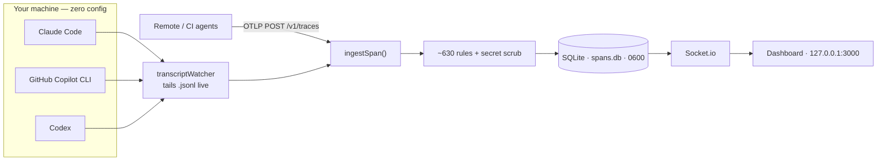

## What is ClaudeSec?

ClaudeSec is a **zero-config, local-first security observatory** for AI coding agents. It watches every Claude Code, GitHub Copilot CLI, and Codex session already running on your machine — across every repo — and surfaces what your agents are actually doing: every tool call, every command, every file touched, scored live against ~630 built-in threat-detection rules.

No environment variables. No restarting your terminal. Nothing ever leaves your computer.

<Note>
  These agents **already write full session transcripts to disk** as they work. ClaudeSec tails those transcripts in real time, so the moment you install it, it sees everything — including sessions that were already running.
</Note>

---

## Install

Clone the repo and run the one-command starter — it installs dependencies, starts the dashboard, and begins watching every agent on your machine right away:

```bash
git clone https://github.com/aanjaneyasinghdhoni/ClaudeSec.git
cd ClaudeSec
./start.sh
```

Prefer to run the steps yourself? They are:

```bash
corepack enable
pnpm install
pnpm dev
```

That's it — open **http://localhost:3000**. See the [Quickstart](/quickstart) for what happens next, including how to run it as a background service.

---

## Key Features

<CardGroup cols={2}>
  <Card title="Zero-config capture" icon="bolt">
    Tails on-disk transcripts for Claude Code, GitHub Copilot CLI, and Codex — real tool names, full command text, durations, and token usage, with no setup.
  </Card>
  <Card title="630 threat rules" icon="shield-halved">
    HIGH / MEDIUM / LOW regex rules covering prompt injection, credential theft, reverse shells, supply-chain attacks, exfiltration, and recon — evaluated on every span.
  </Card>
  <Card title="Honeytokens & secret scrubbing" icon="user-secret">
    Plant canary strings that fire HIGH alerts on exfiltration. Known secret shapes are redacted before anything is stored, broadcast, or exported.
  </Card>
  <Card title="Live timeline & orchestration" icon="timeline">
    Watch tool calls stream in with nanosecond durations. Drill into per-agent tool inventory, a command-audit trail, and a sensitive-file-access panel.
  </Card>
  <Card title="Process scanner" icon="microchip">
    Detect running agent CLIs and kill / pause / resume them straight from the dashboard.
  </Card>
  <Card title="Cost view" icon="dollar-sign">
    API-equivalent cost per session and model, plus subscription-plan awareness (API / Pro / Max 5× / Max 20×).
  </Card>
</CardGroup>

---

## Privacy by construction

ClaudeSec reads sensitive material, so it is built local-first:

- **Loopback only** — the server binds `127.0.0.1` by default.
- **No egress** — nothing is sent anywhere unless you opt in. There are three optional outbound paths, all off unless set: `OTEL_FORWARD_URL` (forward OTLP traces), `CLAUDESEC_WEBHOOK_URL` (alert delivery), and `CLAUDESEC_JUDGE_URL` (the optional LLM-as-judge). All are SSRF-guarded; the judge additionally allows loopback, so it can run fully on-device.
- **Owner-only database** — `spans.db` is created with `0600` permissions.
- **Secret scrubbing on by default** — see [Privacy & Security](/security/privacy).

---

## Architecture at a glance



The watcher and the OTLP endpoint feed the **same** pipeline, so local capture and remote/CI agents land in one dashboard. See [Architecture](/architecture) and [How the watcher works](/explanation/watcher) for the full picture.

---

## Quick links

<CardGroup cols={2}>
  <Card title="Quickstart" icon="rocket" href="/quickstart">
    Install ClaudeSec and see real activity in under a minute.
  </Card>
  <Card title="The dashboard" icon="gauge" href="/observe/timeline">
    A tour of every screen — Timeline, Orchestration, Alerts, Costs, and more.
  </Card>
  <Card title="Security rules" icon="shield" href="/security/rules">
    Understand and extend the built-in detection library.
  </Card>
  <Card title="Remote & CI agents" icon="cloud" href="/how-to/remote-agents">
    Send OTLP traces from machines ClaudeSec can't read from disk.
  </Card>
</CardGroup>
